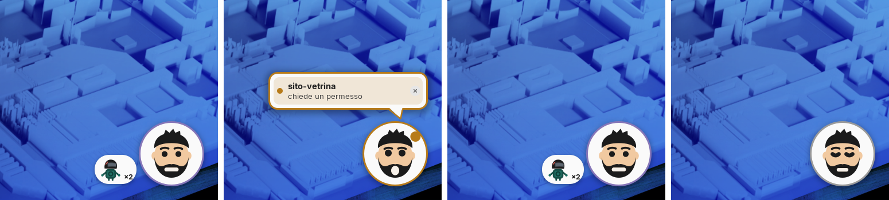
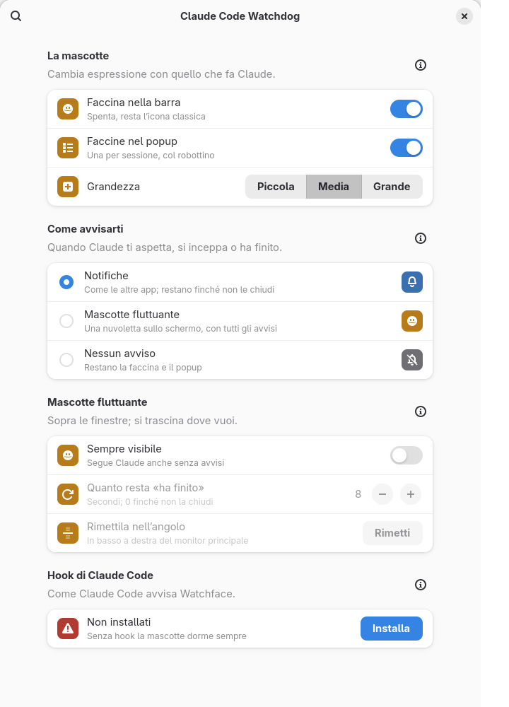

  

  
  
  

  <b>Tiene d'occhio quello che <a href="https://claude.com/claude-code">Claude Code</a> lascia sul tuo PC — e ti dice cosa sta facendo adesso.</b> 
  Disco, conversazioni, quota e progetti nella barra di GNOME. Pulizia senza sorprese, sempre nel cestino.

  
  

<table align="center">
  <tr>
    <td></td>
    <td></td>
  </tr>
</table>

## ✨ Cosa fa

- 🙂 **Watchface** — una faccina nella barra che segue Claude Code: lavora, **ti aspetta**, si è inceppato, fa un /compact, ha finito. Avvisa con una notifica o con una mascotte fluttuante, e un clic ti porta al terminale giusto.
- 📊 **Quota** — sessione e settimana con l'ora esatta dell'azzeramento, e **consigli** su cosa la sta consumando, progetto per progetto.
- 💾 **Spazio** — disco, conversazioni con la loro tendenza, cache di Claude, versioni vecchie: quello che cresce senza che te ne accorga.
- 📁 **Progetti** — uno per riga: apri la cartella, riprendi la conversazione, ricollega un progetto spostato, creane uno nuovo.
- 🧹 **Pulizia** — «Libera spazio» elenca, tu scegli, e tutto finisce nel **cestino**. Mai un clic che cancella.
- 📖 **Guida integrata** — ogni indicatore spiegato, nelle impostazioni.

## 🚀 Installazione

**Con lo zip**: scarica
[`claude-code-watchdog@cirobox.local.shell-extension.zip`](https://github.com/CiroBoxHub/claude-code-watchdog/releases/latest/download/claude-code-watchdog@cirobox.local.shell-extension.zip)
dall'[ultima release](https://github.com/CiroBoxHub/claude-code-watchdog/releases/latest), poi:

    gnome-extensions install --force claude-code-watchdog@cirobox.local.shell-extension.zip

**Dal sorgente**:

    git clone https://github.com/CiroBoxHub/claude-code-watchdog
    cd claude-code-watchdog
    ./bin/install-extension.sh

Poi **logout e login** (su Wayland GNOME non ricarica il codice di
un'estensione in altro modo), `gnome-extensions enable
claude-code-watchdog@cirobox.local`, e dalle impostazioni dell'estensione →
*Watchface* → **Installa** per collegare la faccina a Claude Code. Vale per le
sessioni di Claude aperte da lì in poi.

**Aggiornando**, se la pagina *Watchface* dice «Installati in parte», premi
**Reinstalla**: la versione nuova ascolta eventi in più.

| Serve per | Requisito |
|---|---|
| Estensione | GNOME Shell **48, 49 o 50** |
| Script | **Python 3.10** o superiore, `gio` (c'è su ogni desktop GNOME) |
| Quota | la CLI `claude` nel `PATH` |
| Script di sistema (`scan-system.sh`, `clean.sh`) | Fedora (`dnf5`, `rpm`) e systemd |

L'estensione funziona su qualunque distribuzione con GNOME: gli script che si
porta dentro usano soltanto `du`, `gio`, `gsettings` e `claude`.

### Disinstallare

Prima gli hook, poi l'estensione:

    python3 ~/.local/share/gnome-shell/extensions/claude-code-watchdog@cirobox.local/watchface-hooks.py rimuovi
    gnome-extensions uninstall claude-code-watchdog@cirobox.local

I dati del cruscotto stanno in `~/.local/share/claude-code-watchdog/` e si
possono cancellare.

---

## 🙂 Watchface

| | Stato | Quando |
|:---:|---|---|
|  | **dorme** | nessuna sessione di Claude aperta |
|  | **lavora** | Claude sta pensando o usando strumenti |
|  | **aspetta te** | un permesso o una risposta |
|  | **ha finito** | il turno è chiuso, tocca a te |
|  | **aiutanti** | Claude ha finito, ma i suoi aiutanti in background lavorano ancora |
|  | **si è inceppato** | un errore ha fermato la sessione, o tre strumenti di fila sono falliti |
|  | **/compact** | Claude riassume la conversazione per liberare il contesto: niente avvisi, bordo blu |

Con più sessioni la faccina mostra la più urgente. In cima al popup c'è una
riga per sessione, e **un clic porta davanti il terminale** in cui gira; le
sessioni che Claude avvia in background stanno rientrate sotto quella che le
ha avviate. Quelle aperte da un programma (`claude -p`, l'SDK) non compaiono.

  

**Gli avvisi** — quando Claude ti aspetta, si inceppa o finisce un lavoro di
almeno mezzo minuto — arrivano come notifica, oppure dalla **mascotte
fluttuante**: compare solo quando ha qualcosa da dirti, con una nuvoletta che
elenca gli avvisi di tutte le sessioni. Si trascina dove vuoi, non compare
sopra lo schermo intero, e può anche restare **sempre visibile** come una
seconda faccina. Niente lampeggia per abitudine: lampeggia solo un **segno**
quando serve — due punti interrogativi se Claude ti aspetta, due esclamativi
se si è inceppato, una lampadina mentre c'è lavoro in corso.

**Come lo sa.** A ogni evento Claude Code chiama `watchface-hook`, uno script
da pochi millisecondi che scrive una riga in memoria; l'estensione la legge
solo quando cambia. Non approva e non rifiuta niente. `watchface-hooks.py`
mette e toglie gli hook in `~/.claude/settings.json`, sempre dopo un backup
(se ne tengono tre, e si ripristinano dalle impostazioni).

**Il mod**, attivato dallo stesso pulsante, è un plugin che gira dentro Claude
Code e gli chiede quello che da fuori si può solo dedurre: la quota (senza
accendere una CLI ogni mezz'ora), quali aiutanti lavorano ancora, e la fine di
un turno interrotto con Esc o finito in errore, che Claude Code non segnala.
È facoltativo e si spegne da solo: senza, Watchface funziona come prima.

## 📊 Il pannello

Nel popup: cosa fa Claude adesso, disco, peso delle conversazioni con la
tendenza, cache di Claude, quota con i **consigli** (dietro l'icona «i»: dicono
*dove* va la quota, per esempio una sessione che si porta dietro più di 150k
token di contesto a ogni richiesta), spazio recuperabile e i progetti.

Ogni progetto si apre su tre azioni:

| Azione | Cosa fa |
|---|---|
| **Cartella** | apre la cartella di lavoro nel gestore file |
| **Riprendi** | apre il terminale con `claude --resume` lì dentro |
| **Elimina dati** | toglie trascrizioni, memorie e scratchpad di Claude — **mai** la cartella di lavoro |

Un progetto spostato mostra **Correggi**: indichi la nuova cartella e le sue
conversazioni la seguono. Il «+» accanto a «Progetti» ne crea uno nuovo.

**Libera spazio…** non pulisce: elenca cosa verrebbe tolto, voce per voce, e
cestina solo dopo **Elimina**. Tocca solo dati tuoi, senza privilegi: cestino
scaduto, `~/.cache` stantia, cache e versioni vecchie di Claude Code (tiene
sempre quella in uso), sessioni-fantasma e sessioni automatiche orfane. Una
cartella che nessuna categoria conosce si mette in coda con
`./bin/segnala.py <percorso> --motivo "…"` e compare lì.

### Impostazioni

Da *Impostazioni e guida*, in fondo al popup. La **lente** cerca in tutte le
pagine, e ogni gruppo ha un «?» che porta alla guida.

| Pagina | Cosa c'è |
|---|---|
| **Guida** | ogni indicatore spiegato |
| **Pannello** | valori nella barra, aspetto, sezioni del popup |
| **Watchface** | faccina, grandezza, come avvisarti, hook, mod e backup |
| **Quota** | ogni quanto rileggere la quota e il resto |
| **Progetti** | radice dei progetti, terminale di «Riprendi», conferme |

  

---

## 🖥️ Da terminale

> **Prima si guarda, poi si cancella. E si cancella nel cestino.**
> Ogni script che toglie qualcosa è in anteprima finché non riceve `--apply`.

    ./bin/scan-system.sh                 # stato del sistema (sola lettura)
    ./bin/scan-claude.sh                 # stato di ~/.claude (sola lettura)
    ./bin/claude-sessions.py             # inventario delle conversazioni

    ./bin/clean.sh                       # anteprima di cosa si può liberare
    ./bin/clean.sh --apply               # esegue i target sicuri
    ./bin/clean.sh --apply kernels       # un target delicato, solo per nome
    ./bin/reclaim.py --apply trash       # la variante portabile, quella del pannello

    ./bin/session-purge.py <id>          # tutto ciò che appartiene a una sessione
    ./bin/project-purge.py <cartella>    # i dati Claude di un progetto
    ./bin/project-relocate.py <vecchia> <nuova>   # riaggancia un progetto spostato

`./bin/clean.sh --list` elenca i target. Quelli che richiedono root passano da
`pkexec`, perché dentro Claude Code `sudo` non ha un terminale per la password.

Da dentro Claude Code: `/watchdog-check` (report, non tocca niente),
`/watchdog-clean` (mostra, chiede, libera), `/watchdog-sessions` (le chat, con
il comando per riprenderle).

### Configurazione

Soglie e scadenze stanno in `config/watchdog.conf`; gli script non hanno numeri
cablati dentro.

| Chiave | Cosa regola |
|---|---|
| `CLAUDE_JOBS_RETENTION_DAYS` e affini | quanto tenere job, snapshot, cronologia file, paste |
| `TRASH_RETENTION_DAYS` | dopo quanto un elemento del cestino è scaduto |
| `USER_CACHE_RETENTION_DAYS` | quanto tenere i file stantii di `~/.cache` |
| `JOURNAL_MAX_SIZE`, `KEEP_KERNELS` | journal e kernel |
| `CLAUDE_KEEP_VERSIONS` | quante versioni di Claude Code tenere, più quella in uso |
| `ALERT_*` | soglie degli avvisi |

Le impostazioni del pannello stanno invece in GSettings, dalle preferenze.

## 🔧 Sviluppo

    ./bin/prova.sh                 # prove funzionali, in sandbox con HOME dirottata
    ./bin/prova-js.sh              # prove sulle funzioni dei moduli JS
    ./bin/verifica-estensione.sh   # controlli statici, prove JS e prove del mod
    ./bin/prova-shell.sh           # carica l'estensione in una GNOME Shell annidata
    ./bin/simula-watchface.sh      # fa passare Watchface per tutti gli stati
    ./bin/fotografa-pannello.sh --demo grafica/screenshot   # le foto di questo README
    ./bin/pack-extension.sh        # lo zip in dist/

`install-extension.sh` e `pack-extension.sh` si fermano se i controlli statici
non passano. Le icone si modificano in `grafica/sorgenti/` e si rigenerano con
`./grafica/mascotte.py`, mai a mano in `icons/`.

    bin/                    script da terminale, prove e strumenti
    config/watchdog.conf    soglie, scadenze, consigli sulla quota
    gnome-extension/        l'estensione: extension.js (pannello), watchface.js,
                            fumetto.js (mascotte), prefs.js (impostazioni e guida)
    mods/watchdog/          il mod di Claude Code
    grafica/                sorgenti delle icone e generatore della mascotte

## Autore e licenza

**CiroBoxHub** — [github.com/CiroBoxHub](https://github.com/CiroBoxHub).
La mascotte di Watchface è un ritratto stilizzato dell'autore, con il limone e
il robottino che lo accompagnano.

GPL-2.0-or-later, la stessa di GNOME Shell. Copyright © 2026 CiroBoxHub.
Vedi [`LICENSE`](LICENSE).
