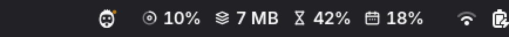
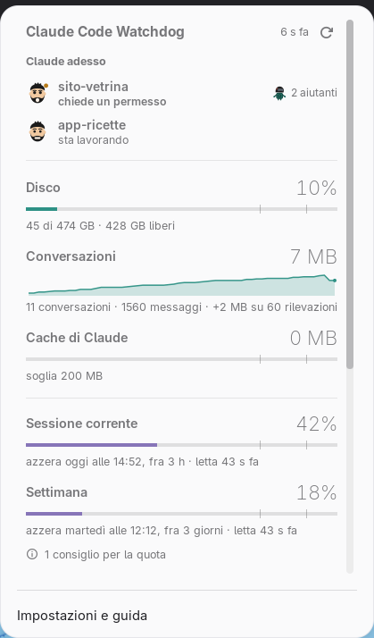
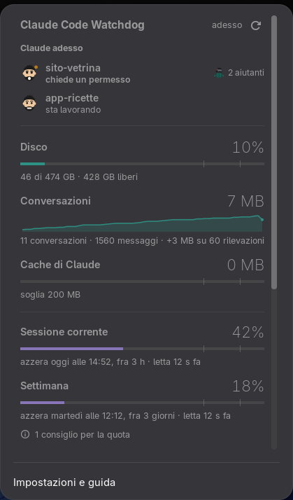
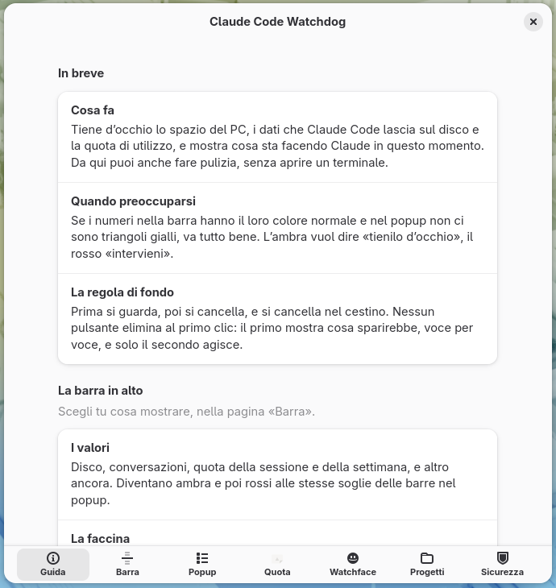
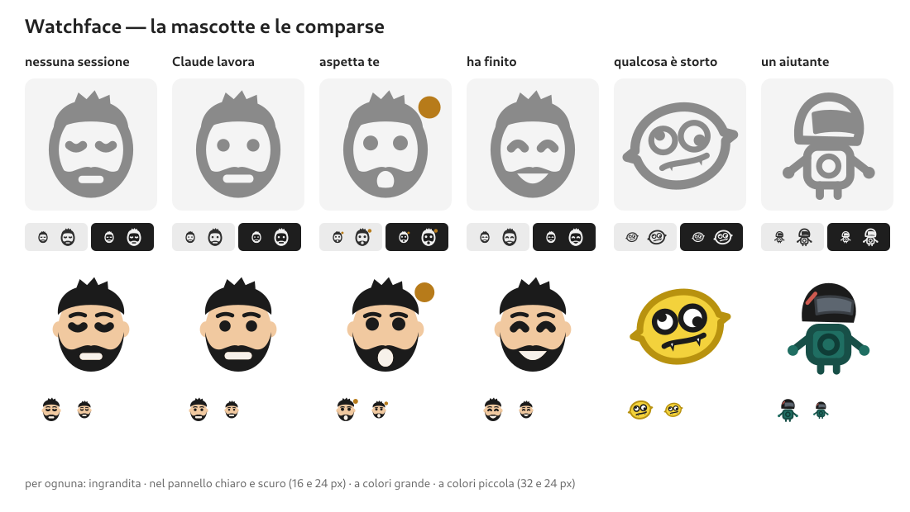

  

  
  
  
  

  <b>Tiene d'occhio quello che <a href="https://claude.com/claude-code">Claude Code</a> lascia sul tuo PC — e ti dice cosa sta facendo adesso.</b> 
  Disco, conversazioni, quota e progetti nella barra di GNOME. Pulizia senza sorprese, sempre nel cestino.

  
  

<table align="center">
  <tr>
    <td></td>
    <td></td>
  </tr>
</table>

Foto vere della shell, con dati inventati: <code>bin/fotografa-pannello.sh --demo</code>.

## ✨ Cosa fa

- 🙂 **Watchface** — una faccina nella barra che segue Claude Code: dorme, lavora, **ti aspetta** (un permesso, una risposta) o ha finito. Con le notifiche quando serve davvero.
- 📊 **Quota** — sessione e settimana con l'ora esatta dell'azzeramento, e **consigli** su cosa la sta consumando: per progetto, non solo in percentuale.
- 💾 **Spazio** — disco, conversazioni con la loro tendenza, cache di Claude, versioni vecchie: tutto quello che cresce senza che te ne accorga.
- 📁 **Progetti** — uno per riga: apri la cartella, riprendi la conversazione nel terminale, ricollega un progetto spostato, creane uno nuovo con un clic.
- 🧹 **Pulizia** — «Libera spazio» elenca, tu scegli, e tutto finisce nel **cestino**. Mai un clic che cancella.
- 📖 **Guida integrata** — ogni indicatore spiegato, direttamente nelle impostazioni.

### Watchface

| | Stato | Quando |
|:---:|---|---|
|  | **dorme** | nessuna sessione di Claude aperta |
|  | **lavora** | Claude sta eseguendo, pensando, usando strumenti |
|  | **aspetta te** | un permesso o una risposta: il punto ambra |
|  | **ha finito** | il turno è chiuso, tocca a te |
|  | **si è inceppato** | un errore ha fermato la sessione, o tre strumenti di fila sono falliti |
|  | **aiutanti** | nel popup, quando Claude ha mandato dei subagenti |

## 🚀 Installazione rapida

    git clone https://github.com/CiroBoxHub/claude-code-watchdog
    cd claude-code-watchdog
    ./bin/install-extension.sh

Poi **logout e login**, e dalle impostazioni dell'estensione → *Watchface* →
**Installa** per collegare la faccina a Claude Code. Su un PC dove non vuoi
clonare il repository c'è lo zip: vedi [Su un altro PC](#su-un-altro-pc).

  

---

## Due strumenti in uno

| | Cosa fa | Dove gira |
|---|---|---|
| **Estensione GNOME** | Cruscotto nel pannello: cosa fa Claude adesso, disco, conversazioni per progetto, quota, spazio recuperabile, andamento nel tempo. Da lì si interviene senza aprire un terminale. | Qualunque distribuzione con GNOME |
| **Script da terminale** (`bin/`) | Scansione del sistema, inventario delle conversazioni, pulizia guidata, riparazione dei progetti spostati. | Fedora per i target di sistema, ovunque per il resto |

## La regola che tiene insieme tutto

> **Prima si guarda, poi si cancella. E si cancella nel cestino.**

Nessuno script cancella niente senza averlo prima elencato voce per voce e
aver ricevuto un sì esplicito. `clean.sh` e `reclaim.py` sono in **dry-run**
finché non ricevono `--apply`. Le rimozioni che riguardano conversazioni
passano da `gio trash`, quindi si recuperano dal gestore file.

La regola è nata da un errore: due conversazioni — una da 4380 messaggi —
sono andate perse perché al posto del cestino c'era un `unlink()`. L'elenco di
conferma era corretto e chi ha confermato sapeva cosa stava facendo; il difetto
era non lasciare un ripensamento possibile su dati che non si ricostruiscono.

---

## Requisiti

| Serve per | Requisito |
|---|---|
| Estensione | GNOME Shell **48, 49 o 50** |
| Script Python | **Python 3.10** o superiore |
| Cestino | `gio` (arriva con GLib, c'è già su ogni desktop GNOME) |
| Lettura della quota | CLI `claude` nel `PATH` |
| `scan-system.sh`, target di sistema di `clean.sh` | Fedora (`dnf5`, `rpm`) e systemd |

L'estensione non dipende da nessuna di queste ultime: gli script che si porta
dentro invocano soltanto `du`, `gio`, `gsettings` e `claude`.

## Installazione

    git clone https://github.com/CiroBoxHub/claude-code-watchdog
    cd claude-code-watchdog

    ./bin/prova.sh                 # 136 prove funzionali in sandbox
    ./bin/install-extension.sh     # installa l'estensione
    gnome-extensions enable claude-code-watchdog@cirobox.local

Poi **logout e login**. Non è pignoleria: GNOME Shell tiene in cache il modulo
ES già importato, quindi `disable/enable` non rilegge il codice. Su Wayland non
esiste scorciatoia.

Per **Watchface** servono anche gli hook di Claude Code: dalle impostazioni
dell'estensione, pagina *Watchface*, pulsante **Installa**. Oppure da terminale:

    python3 ~/.local/share/gnome-shell/extensions/claude-code-watchdog@cirobox.local/watchface-hooks.py installa

Prima di toccare `~/.claude/settings.json` ne fa un backup. Claude Code legge
gli hook all'avvio: le sessioni già aperte non li vedono, quelle nuove sì.

Gli script da terminale non vanno installati: si usano dove sono.

### Su un altro PC

    ./bin/pack-extension.sh        # produce dist/*.zip

    # sull'altra macchina
    gnome-extensions install --force claude-code-watchdog@cirobox.local.shell-extension.zip
    gnome-extensions enable claude-code-watchdog@cirobox.local
    # logout e login

Lo zip porta con sé gli script Python, l'hook di Watchface e le icone, quindi
funziona anche dove il repository non è stato clonato.

### Disinstallare

Prima gli hook, poi l'estensione: in quest'ordine `settings.json` non resta con
hook che puntano a un file sparito.

    python3 ~/.local/share/gnome-shell/extensions/claude-code-watchdog@cirobox.local/watchface-hooks.py rimuovi
    gnome-extensions uninstall claude-code-watchdog@cirobox.local

Se l'ordine si inverte non succede niente di grave: ogni hook finisce con
`|| true`, quindi Claude Code non mostra errori. Restano solo righe inutili in
`settings.json`, che si tolgono a mano o ripristinando un backup da
`~/.local/share/claude-code-watchdog/backup-settings/`. I dati del cruscotto
stanno in `~/.local/share/claude-code-watchdog/` e si possono cancellare.

---

## Watchface, come funziona

Cosa sta facendo Claude Code, senza tornare al terminale. La faccina nella
barra **dorme** quando non ci sono sessioni, **lavora**, **aspetta te** — un
permesso o una risposta, con un punto ambra — oppure **ha finito**. Il
**limone** arriva quando qualcosa si inceppa (sessione fermata da un errore,
tre strumenti falliti di fila), il **robottino** nel popup quando Claude manda
degli aiutanti. Con più sessioni vince la più urgente.

In cima al popup, *Claude adesso* elenca le sessioni aperte. Le notifiche
arrivano quando Claude ti aspetta, si inceppa o finisce un lavoro di almeno
mezzo minuto — non se stai già guardando il terminale. Mascotte e notifiche si
spengono dalle impostazioni; senza mascotte resta l'icona classica, che si
colora d'ambra o di rosso negli stati urgenti.

**Come funziona.** Claude Code avvisa `watchface-hook` a ogni evento. È uno
script Bash da circa 3 ms che scrive una riga per sessione in
`$XDG_RUNTIME_DIR` (in memoria); l'estensione la osserva con inotify, senza
interrogare niente a intervalli. Lo script non scrive nulla sull'output — per
una richiesta di permesso l'output di un hook è una risposta — ed esce sempre
con 0: non approva, non rifiuta, non blocca.

`watchface-hooks.py` installa, rimuove e ripristina gli hook in
`~/.claude/settings.json`, con un backup prima di ogni modifica, e sa togliere
anche gli hook di altri programmi che facciano lo stesso lavoro. Un
`settings.json` che non è JSON valido non viene mai riscritto.

## Il pannello

Nel popup: cosa fa Claude adesso, disco, peso di `~/.claude` con la tendenza,
cache di Claude, quota (sessione corrente e settimana) con i **consigli** su
cosa la sta consumando, spazio recuperabile, e l'elenco dei **progetti
cliccabili**.

I consigli sulla quota, dietro l'icona «i», si calcolano dalle conversazioni di
questo PC: dicono *dove* va la quota, cosa che `/usage` non dice — per esempio
una sessione aperta da settimane che si porta dietro più di 150k token di
contesto a ogni richiesta.

La barra della cache misura **solo** `~/.cache/claude` e
`~/.cache/claude-cli-nodejs` — lo staging degli aggiornamenti e i log degli
MCP. Non tutta `~/.cache`, dove il grosso è sempre il browser: quella la
sorveglia `scan-system.sh`, che è lo strumento di sistema. Il fondoscala è
`ALERT_CLAUDE_CACHE_MB` e non il disco, perché la domanda è se si è superato
il limite che ci si è dati, non quanto pesa su un terabyte.

Ogni riga di progetto si apre su tre azioni:

| Azione | Cosa fa |
|---|---|
| **Cartella** | Apre la cartella di lavoro nel gestore file |
| **Riprendi** | Apre il terminale ed esegue `claude --resume` lì dentro |
| **Elimina dati** | Rimuove i dati che Claude Code tiene per proprio conto |

**«Elimina dati» non tocca mai la cartella di lavoro.** Rimuove trascrizioni,
memorie, job e scratchpad; i file veri restano. Lo script ha una rete di
sicurezza che scarta qualunque percorso caschi dentro la cartella di lavoro,
anche se ci finisse per errore.

Se un progetto è stato spostato, la sua riga mostra **Correggi**: si indica la
nuova cartella, lo strumento verifica che i file citati nelle conversazioni
esistano davvero lì, e solo allora riscrive il percorso e sposta le
trascrizioni. Il «+» accanto a «Progetti» ne crea uno nuovo e ci apre subito
una sessione.

### Libera spazio

Il pulsante **Libera spazio…** non pulisce: apre l'elenco di cosa verrebbe
tolto, voce per voce, con un interruttore per ciascuna. Si elimina solo dopo un
secondo clic su **Elimina**.

Tocca esclusivamente dati dell'utente, senza chiedere privilegi:

`trash` · `usercache` · `claude-cache` · `claude-versions` · `claude-stubs` ·
`claude-jobs` · `claude-snapshots` · `claude-paste` · `claude-filehistory`

Cache dei pacchetti, journal e kernel richiedono root e restano appannaggio di
`clean.sh` da terminale.

**`claude-versions`** è di solito la voce più grossa. Claude Code tiene tutte
le versioni che ha installato in `~/.local/share/claude/versions/`, una per
aggiornamento, circa 220 MB l'una, e non ne toglie mai nessuna. Si tengono le
`CLAUDE_KEEP_VERSIONS` più recenti — due di serie, così un aggiornamento
andato male si può annullare — più quella in uso, che non sempre è la più
recente. La versione in esecuzione si ricava risolvendo il link di `claude`,
mai dal numero più alto: se non si riesce a stabilire quale sia, la voce non
compare affatto invece di tirare a indovinare.

### Segnalazioni

Per le cose che nessuna categoria conosce — una cartella dati rimasta da una
rinomina, l'export di un esperimento — c'è una coda:

    ./bin/segnala.py ~/.local/share/roba-vecchia --motivo "residuo di una rinomina"
    ./bin/segnala.py --elenco
    ./bin/segnala.py --togli ~/.local/share/roba-vecchia

La voce compare nel pannello con nome, peso e motivo, insieme a tutte le altre,
e si cestina con lo stesso pulsante. **Il pannello non ha un campo dove
digitare un percorso**: mostra solo quello che è già in coda.

Segnalare non cancella niente, scrive una riga in un file. Sia al momento di
segnalare sia al momento di cestinare valgono gli stessi controlli: dentro la
home, mai sotto `~/.claude` (per quello ci sono `session-purge.py` e
`project-purge.py`, che verificano prima), mai una cartella che ne contiene una
di lavoro. Il pulsante agisce solo su percorsi che trova davvero nella coda,
qualunque cosa gli venga passata.

### Impostazioni

Dall'icona *Impostazioni e guida* nel popup si sceglie cosa compare nella
barra, quali sezioni mostrare, ogni quanto aggiornare, ogni quanto rileggere la
quota e dove nascono i progetti nuovi. La prima pagina è una guida che spiega
ogni indicatore.

Lasciando vuota la radice dei progetti viene dedotta da sola: è la cartella che
contiene più progetti fra quelli già noti.

### Come è fatto

L'estensione **non calcola niente**. Legge
`~/.local/share/claude-code-watchdog/metrics.json`, prodotto dal raccoglitore,
e `history.jsonl` per il grafico. Correggere una misura significa toccare gli
script, non il codice della shell.

Per lo stesso motivo **in `extension.js` non c'è nessuna costante
configurabile**: una costante lì si cambierebbe solo con logout e login. Tutto
ciò che si regola sta in GSettings e viene riletto a ogni giro.

I file del cruscotto contengono i nomi dei progetti — quindi, potenzialmente,
dei clienti. La cartella è `700` e i file `600`.

---

## Da terminale

    ./bin/scan-system.sh                 # stato del sistema
    ./bin/scan-claude.sh                 # stato di ~/.claude
    ./bin/claude-sessions.py             # inventario delle conversazioni
    ./bin/claude-sessions.py --older-than 90

    ./bin/clean.sh                       # anteprima: cosa si può liberare
    ./bin/clean.sh --list                # elenco dei target
    ./bin/clean.sh --apply               # esegue i target "sicuri"
    ./bin/clean.sh --apply dnf journal   # solo questi due

    ./bin/reclaim.py --apply trash usercache   # la variante portabile

Gli scan sono a sola lettura.

    ./bin/session-purge.py <id>          # elenca tutto ciò che appartiene a una sessione
    ./bin/session-purge.py <id> --apply
    ./bin/project-purge.py <cartella>    # i dati Claude di un intero progetto
    ./bin/project-relocate.py <vecchia> <nuova>   # riaggancia un progetto spostato
    ./bin/fix-cwd.py                     # allinea la cwd dichiarata alla cartella reale
    ./bin/segnala.py <percorso>          # mette in coda qualcosa da liberare

I target che richiedono root non possono usare `sudo` da dentro Claude Code:
manca un terminale per la password, e nemmeno il prefisso `!` lo risolve.
`clean.sh` ripiega su `pkexec`, che mostra il dialogo di autenticazione di
GNOME sul desktop.

### Target di pulizia

**Sicuri** — inclusi quando non si specifica niente:

`dnf` `journal` `coredump` `logs` `trash` `usercache` `flatpak`
`claude-stubs` `claude-jobs` `claude-snapshots` `claude-paste`
`claude-filehistory`

`reclaim.py` aggiunge `claude-cache`, `claude-versions` e le segnalazioni, che
`clean.sh` non ha: sono nati per il pannello.

Nota sulle finestre di scadenza: un target toglie solo i file più vecchi della
sua retention. Su una macchina appena installata può quindi non esserci niente
da togliere anche quando la barra è alta — non è un errore, è che nessun file
ha ancora l'età richiesta.

**Delicati** — solo se richiesti per nome, mai in automatico:

`kernels` `orphans` `claude-dups` `claude-projects`

`reclaim.py` fa i sette portabili di quella lista: è lo script che
viaggia dentro l'estensione, e non deve presumere né Fedora né privilegi.
`clean.sh` resta la versione completa per la riga di comando.

### Sessioni-fantasma

Sono trascrizioni in cui l'assistente non ha mai risposto: le lasciano dietro
le invocazioni non interattive di Claude — una statusline che chiama `/usage`,
un hook, uno script SDK. Non sono conversazioni, si rigenerano da sole e
gonfiano il selettore di `claude --resume`. Il target `claude-stubs` le manda
nel cestino e non le cancella, perché il criterio «nessuna risposta» può
pescare anche una conversazione vera interrotta prima della prima risposta.

## Da dentro Claude Code

| Comando | Cosa fa |
|---|---|
| `/watchdog-check` | Report su sistema e Claude. Non tocca niente. |
| `/watchdog-clean` | Mostra cosa si può liberare, chiede, poi libera. |
| `/watchdog-sessions` | Elenco delle chat, con il comando per riprenderle. |

---

## Configurazione

Tutto in `config/watchdog.conf`: quanti giorni tenere i sottoprodotti di
Claude, il tetto del journal, quanti kernel lasciare installati, le soglie
oltre le quali scatta l'allarme. Gli script leggono da lì e non hanno numeri
cablati dentro.

| Chiave | Cosa regola |
|---|---|
| `CLAUDE_JOBS_RETENTION_DAYS` e affini | Quanto tenere job, snapshot, cronologia file, paste |
| `TRASH_RETENTION_DAYS` | Dopo quanto un elemento cestinato è considerato scaduto |
| `USER_CACHE_RETENTION_DAYS` | Quanto tenere i file stantii di `~/.cache` |
| `JOURNAL_MAX_SIZE`, `COREDUMP_RETENTION_DAYS` | Limiti del journal e dei coredump |
| `KEEP_KERNELS` | Quanti kernel lasciare installati |
| `CLAUDE_KEEP_VERSIONS` | Quante versioni di Claude Code tenere, quella in uso compresa |
| `CLAUDE_CACHE_RETENTION_DAYS` | Quanto tenere i log degli MCP in `~/.cache/claude-cli-nodejs/` |
| `ALERT_CLAUDE_CACHE_MB` | Fondoscala della barra della cache, e soglia dell'avviso |
| `ALERT_*` | Soglie oltre le quali `/watchdog-check` segnala |

Le impostazioni del pannello, invece, stanno in GSettings e si cambiano dalle
preferenze dell'estensione: la cadenza di aggiornamento è `refresh-seconds`,
non una chiave del file di configurazione.

Il cestino è potato leggendo `DeletionDate` dai `.trashinfo`, **non** l'mtime:
un documento modificato due anni fa e buttato ieri ha l'mtime vecchio, e
potarlo per quello lo distruggerebbe il giorno dopo averlo cestinato.

## Sviluppo

    ./bin/prova.sh                 # 136 prove funzionali, sandbox con HOME dirottata
    ./bin/prova-js.sh              # 41 prove sulle funzioni pure dei moduli JS
    ./bin/prova-shell.sh           # carica l'estensione in una GNOME Shell annidata
    ./bin/verifica-estensione.sh   # controlli statici, e le prove JS
    ./bin/fotografa-pannello.sh    # foto di barra, popup e preferenze, chiaro e scuro
    ./bin/fotografa-pannello.sh --demo grafica/screenshot   # le foto del README, con dati inventati
    ./bin/fotografa-icone.sh       # foto delle icone come le disegna la shell
    ./grafica/mascotte.py          # rigenera le icone (serve Inkscape)

Le due `fotografa-*` girano in una GNOME Shell annidata con una **home finta**:
dconf ed estensioni della sessione vera non si toccano.

**Le icone si modificano in `grafica/`, mai in `icons/`.** I sorgenti sono
disegnati a tratto e leggibili; `mascotte.py` li consegna convertiti in sole
forme piene, perché la shell riempie ogni forma di un'icona *-symbolic* del
colore del testo e lascia i tratti del colore scritto nel file. Scoperto
fotografando la shell vera: le icone a tratto uscivano piene e col bordo grigio.

I controlli statici girano dentro `install-extension.sh` e `pack-extension.sh`,
che si fermano se qualcosa non torna. Verificano la sintassi, lo schema
GSettings, le icone, i metodi chiamati ma mai definiti, le chiavi GSettings
inesistenti, le classi CSS non dichiarate e gli script che l'estensione cita ma
che nessuno copia al suo interno.

Le prove funzionali esistono perché i controlli statici non bastano: girano su
dati finti in una sandbox con `HOME` dirottata, e coprono i casi in cui un
difetto si vede solo eseguendo — una radice dedotta male, il cestino potato con
il criterio sbagliato, due script che codificano lo stesso percorso in modo
diverso.

## Struttura

    bin/                    script da terminale, script che l'estensione si porta
                            dentro, prove e strumenti di sviluppo
    config/watchdog.conf    soglie, scadenze, consigli sulla quota
    gnome-extension/        l'estensione: extension.js (pannello e popup),
                            watchface.js (stato di Claude), prefs.js (impostazioni
                            e guida), icons/ (generate), schemas/
    grafica/                sorgenti delle icone e generatore della mascotte

## Autore

**CiroBoxHub** — [github.com/CiroBoxHub](https://github.com/CiroBoxHub).
La mascotte di Watchface è un ritratto stilizzato dell'autore, con il limone e
il robottino che lo accompagnano.

## Licenza

GPL-2.0-or-later, la stessa di GNOME Shell. Copyright © 2026 CiroBoxHub.
Vedi [`LICENSE`](LICENSE).
